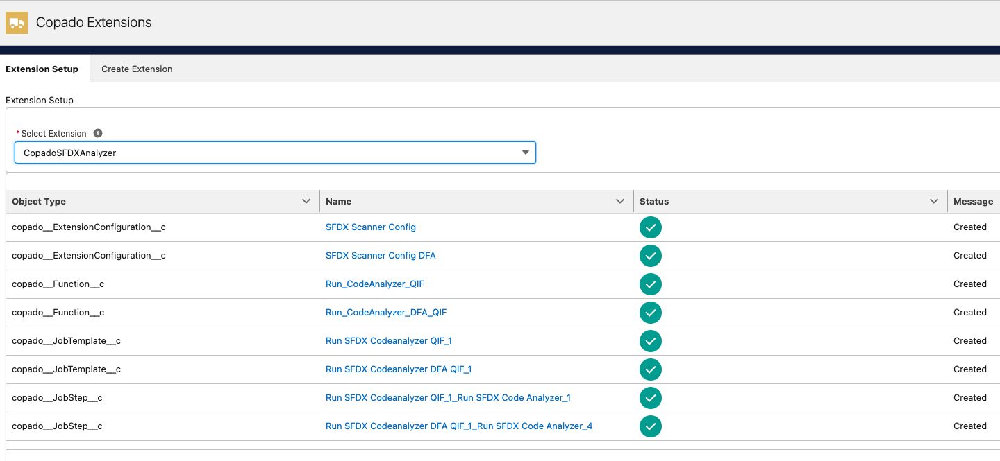
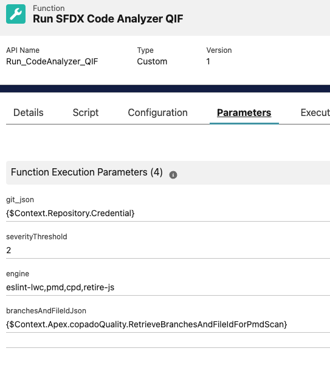
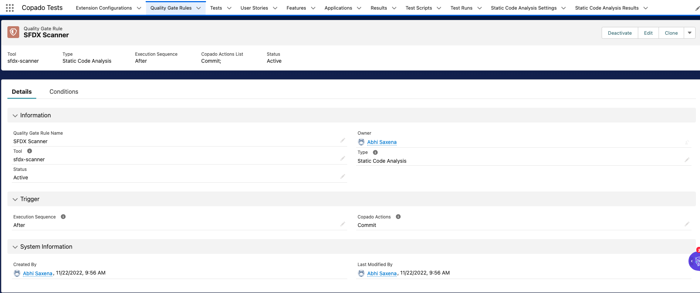
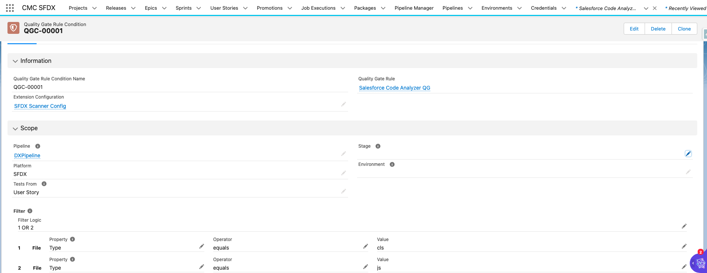
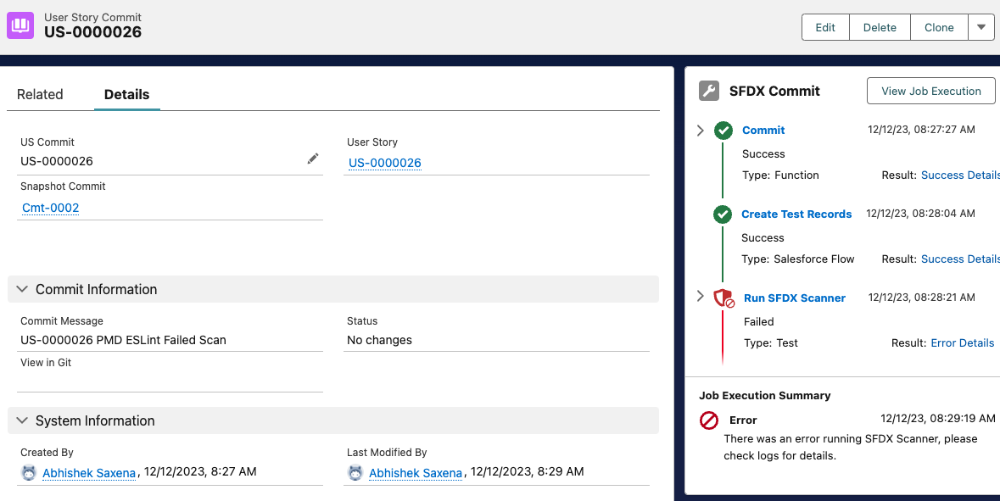
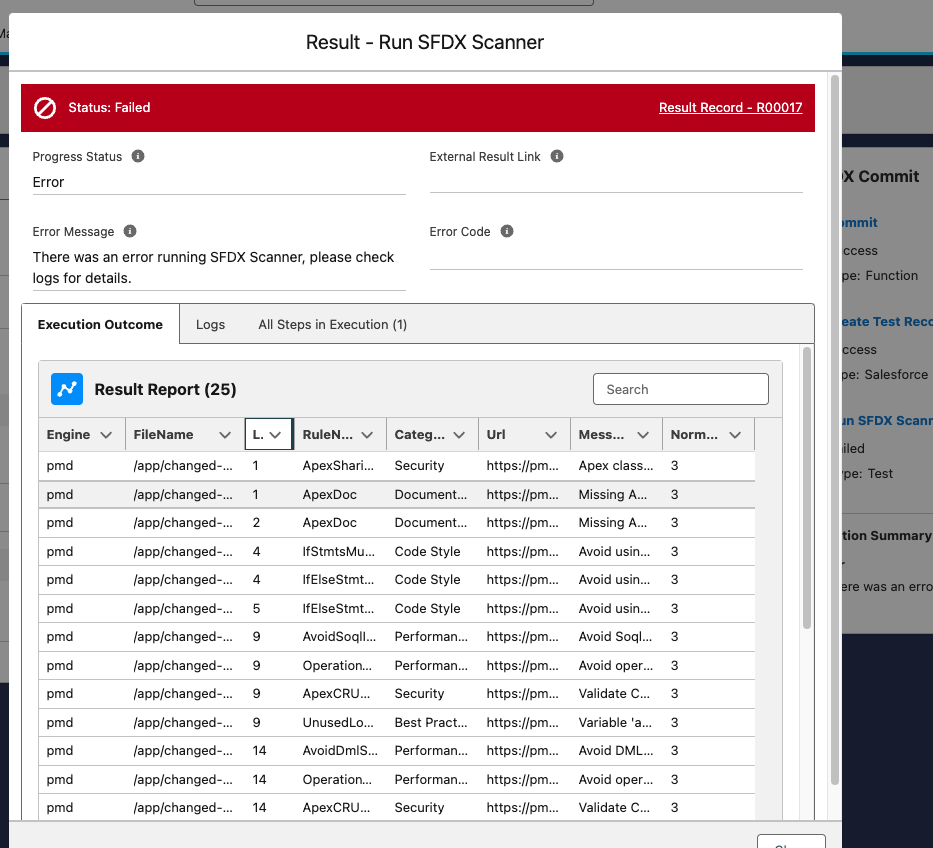
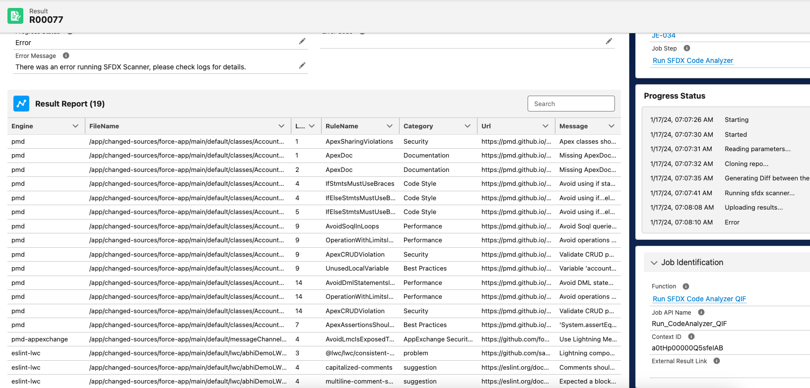
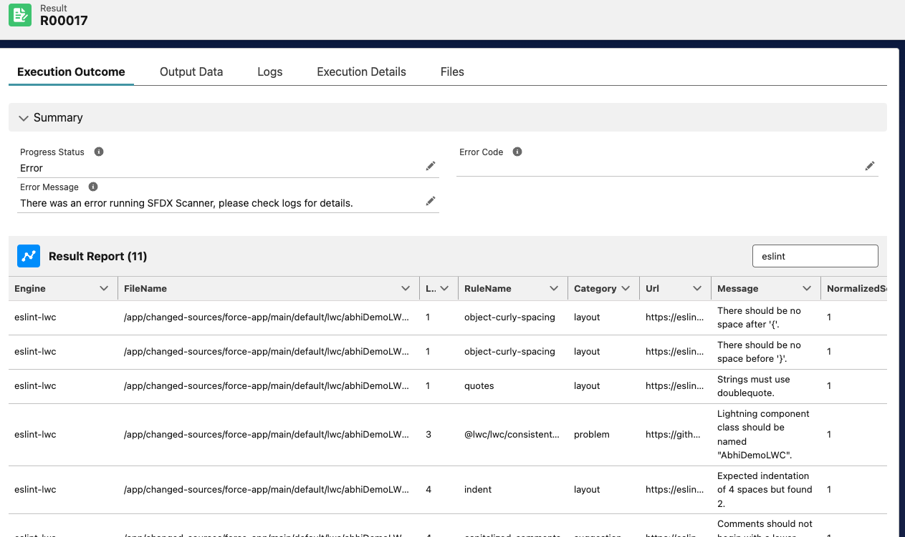
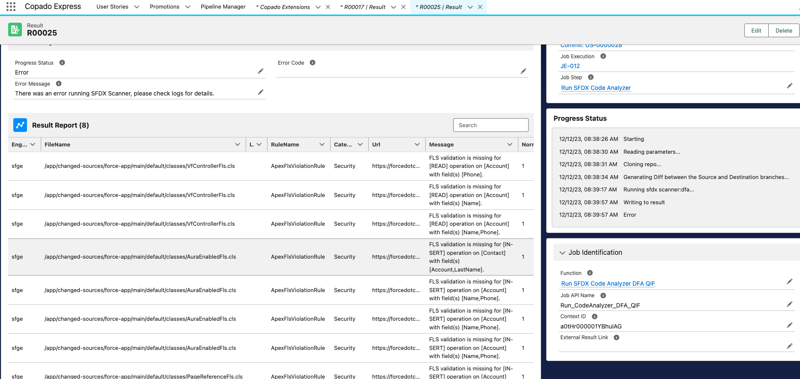

With this project, you can use Code Analyzer as a quality gate within Copado, and run it on the changed/updated components in your Copado User Story or enforce it before every deployment. All results are available within the Test and Result objects.

**Q: What is Salesforce Code Analyzer (Code Analyzer)?**

Code Analyzer is a Salesforce CLI plug-in that helps developers write better and more secure code.

To inspect your code, Code Analyzer uses multiple code analysis engines, including PMD, ESLint, RetireJS, and Salesforce Graph Engine. It identifies potential problems, from inconsistent naming to security vulnerabilities, including advanced vulnerabilities such as lack of Create Read Update Delete/Field-Level Security (CRUD/FLS) checks. Code Analyzer conveys these problems with easy-to-understand results. Run the code analyzer on-command in the CLI, or integrate it into your Continuous Integration/Continuous Development (CI/CD) framework so that you can run it against every code change or on a scheduled basis. Please read more [here.](https://forcedotcom.github.io/sfdx-scanner/en/v3.x/faq/)

# Installing the Extension

## v2.x Release Notes

- Results are now shown in a LWC Component on the Result Modal, no need to download the HTML file to review errors.

- Removed previously used Flows and Apex Classes from Job Templates to make the extension lightweight.

## Upgrading from 1.x version to 2.x version

- The new 2.x version relies on some new capabalities by the Copado Deployer and Quality tools package, hence minimum requirements have changed. Please upgrade those packages to the required version as listed in the [Pre-requisites](#pre-requisites) section

- Upgrading to a new version will overwrite any custom values that were set on the `severityThreshold` and `engine` parameter. Please save them before upgrading and reset after the upgrade.

- After upgrading, navigate to the “Copado Extensions” tab, select “CopadoSFDXAnalyzer” and press the button “Generate Extension Records”.

## Pre-Requisites
* Install Copado v21.14 or higher
* Install Copado Quality Tools extension v1.42 or higher
* Install Copado DX Extension v4.19 or higher
* Install the [latest version of Copado SFDX Analyzer](https://success.copado.com/s/listing-detail?recordId=a545p000000Xx1hAAC) from Copado's DevOps Exchange or check in [sfdx-project.json](./sfdx-project.json).

## Picklist Values

* Create the Following Picklist values
* Object: Extension Configuration, Field: Extension Tool, Value: `sfdx-scanner` & `sfdx-scanner-dfa`
* Picklist Value Set: Copado Test Tool, Value: `sfdx-scanner` & `sfdx-scanner-dfa`

## Create The Functions and Job Templates
Navigate to the “Copado Extensions” tab, select “CopadoSFDXAnalyzer” and press the button “Generate Extension Records”.

## Configure Function Parameters

* `severityThreshold` - Throws an error when violations are found with equal or greater severity than the provided value. Normalized severity values are: 1 (high), 2 (moderate), and 3 (low). Exit code is the most severe violation. The default OOB value set is `2`. Feel free to edit it as per your project needs.

* `engine` - Specifies one or more engines to run. Submit multiple values as a comma-separated list. Valid values need to be from either of these `eslint,eslint-lwc,eslint-typescript,pmd,retire-js,cpd`.
The default OOB value is set to `eslint-lwc,pmd,cpd,retire-js,pmd-appexchange`. Feel free to edit it as per your project needs.

## Configure the Quality Gate

### Create the Quality Gate Rule
Navigate to the Quality Gate Rules tab and create a new record as follows. Note that the Type field will be populated automatically upon save. The global value set Test Tool should have a value for `SFDX Scanner` as part of this package. It can be created manually if necessary.

### Create the Quality Gate Rule Condition
Set the conditions so that it only applies to `Pipelines/Stages/Environments` with Platform = `SFDX`. This picklist value can be added manually if necessary.
Once saved, press the button “Activate” on the Quality Gate Rule record.

**Repeat these steps to create a QG and QGRC for `SFDX-Scanner-DFA` as well.**

**After that you are all set.**

To test the configuration, just perform a commit which contains ApexClass/LWC/AuraBundle on a user story on a SFDX platform Pipeline, and the Commit Action will enforce `SFDX Analyzer` after every commit.

Here's some [test-data](./test-data/) that can be used to test both the Quality Gates

## Demo Screenshots

### Successful run with no violations and it's result

### Run with Violations

The Result record can be further opened to read the violations better, as well as wrap text and search to filter violations.

### Run with Violations for DFA

